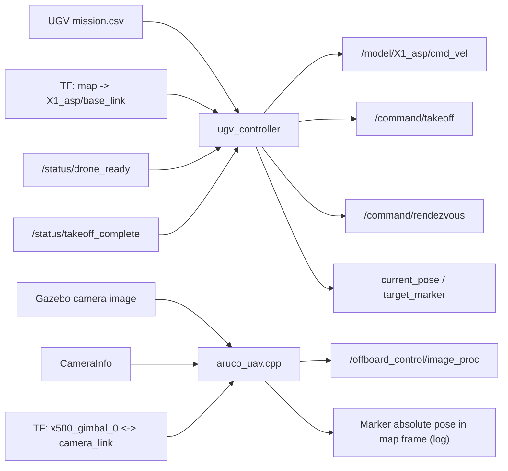

# UAV-UGV Cooperation-Based Autonomous System Platform

## 개요


제 담당 범위는 다음 두 영역에 집중되어 있습니다.

- UGV 경로 추종 및 미션 구간 제어
- UAV 착륙을 위한 ArUco 마커 인지 모듈

이 README는 제가 직접 구현한 `ugv_controller` 패키지 전체와 `uav_controller/src/aruco_uav.cpp`를 포트폴리오 관점에서 설명하기 위한 문서입니다. UAV 전체 미션 상태기계, PX4 오프보드 비행 제어, Gazebo 환경 구성, TF 브리지 구성은 프로젝트 전체에는 포함되지만 제 담당 범위는 아니므로 여기서는 분리해서 설명합니다.

## 담당 범위

| 영역 | 패키지/모듈 | 구현한 내용 |
|---|---|---|
| Ground Control | [`ugv_controller`](./ugv_controller) | `mission.csv` 기반 경로 추종, TF 기반 UGV pose 추정, PID 속도/조향 제어, 곡률 기반 속도 조절, 이륙 지점 정차 로직, UAV 이륙/랑데부 신호 송수신 |
| UAV Vision | [`uav_controller/src/aruco_uav.cpp`](./uav_controller/src/aruco_uav.cpp) | 카메라 영상 기반 ArUco 검출, `CameraInfo` 보정값 반영, OpenCV pose 추정, 카메라-기체 오프셋 보정, TF 기반 `map` 좌표 변환, 디버그 이미지 발행 |

## 담당 범위 제외

아래 항목들은 전체 시스템에는 포함되지만 제 담당 범위는 아니었습니다.

- `uav_controller/src/uav_controller.cpp`
- PX4 오프보드 비행 제어 스택
- Gazebo 환경 세팅 및 TF 브리지
- `Micro-XRCE-DDS-Agent`
- `PX4-Autopilot_ASP`
- `utilities_pkg`

## 시스템 목표

제가 맡은 모듈 기준으로 이 시스템은 다음 흐름을 수행하도록 설계되었습니다.

- UGV가 미리 정의된 지상 경로를 따라 UAV 탑재 상태로 이동
- 지정된 waypoint에서 감속 및 정차 후 UAV 이륙 신호 전송
- UAV 이륙 완료 신호를 수신하면 UGV가 다음 경로를 계속 주행
- 전체 지상 미션 종료 후 UGV가 UAV에 rendezvous 시작 신호 전송
- UAV 하향 카메라에서 ArUco 마커를 검출하고 `map` 기준 위치를 추정해 정밀 착륙 인지 기반 제공

## End-To-End 파이프라인



## 주요 기능

### 1. UGV 경로 추종 및 미션 제어

- `mission.csv` 기반 waypoint 로딩
- TF에서 `map -> X1_asp/base_link`를 조회해 현재 위치와 yaw 추정
- PID 기반 속도 및 조향 제어
- waypoint 곡률 기반 속도 조절
- waypoint index 구간별 속도 프로파일 적용
- UAV 이륙 지점에서 감속, 정차, 이륙 신호 송신
- UAV 이륙 완료 후 다음 waypoint로 재출발
- 전체 지상 미션 종료 후 rendezvous 신호 발행

### 2. UAV 착륙용 ArUco 인지

- Gazebo 카메라 이미지와 `CameraInfo` 구독
- OpenCV ArUco 검출 및 `estimatePoseSingleMarkers` 기반 자세 추정
- OpenCV 좌표계 결과를 ROS/TF 좌표계로 변환
- 카메라와 기체 기준점 사이 오프셋을 반영한 상대 위치 보정
- TF를 사용해 마커 pose를 `map` 기준 절대 좌표로 변환
- 디버그용 processed image 발행

## 패키지별 요약

### `ugv_controller`

이 패키지는 제가 맡은 지상 이동 제어의 핵심입니다. UGV의 현재 pose를 TF에서 읽고, 미리 정의된 waypoint를 추종하면서 UAV와의 협업 시점을 관리합니다.

- 주요 파일:
  - `ugv_controller/src/path_follower_node.cpp`
  - `ugv_controller/config/path_follower_params.yaml`
  - `ugv_controller/launch/path_follower.launch.py`
  - `ugv_controller/path/mission.csv`
- 입력:
  - `mission.csv`
  - TF `map -> X1_asp/base_link`
  - `/status/drone_ready`
  - `/status/takeoff_complete`
- 주요 출력:
  - `/model/X1_asp/cmd_vel`
  - `/command/takeoff`
  - `/command/rendezvous`
  - `current_pose`
  - `target_marker`

### `uav_controller/src/aruco_uav.cpp`

이 모듈은 UAV 착륙 단계에서 사용할 ArUco 기반 시각 인지 모듈입니다. 카메라 영상에서 마커를 검출하고, 마커 위치를 `map` 좌표계로 변환해 정밀 착륙 판단의 기반 정보를 제공합니다.

- 주요 파일:
  - `uav_controller/src/aruco_uav.cpp`
- 입력:
  - `/world/default/model/x500_gimbal_0/link/camera_link/sensor/camera/image`
  - `/world/default/model/x500_gimbal_0/link/camera_link/sensor/camera/camera_info`
  - TF `x500_gimbal_0 <-> x500_gimbal_0/camera_link`
- 주요 출력:
  - `/offboard_control/image_proc`
  - `map` 기준 마커 절대 위치 로그

## 저장소 구조

```text
.
├── ugv_controller
│   ├── config
│   ├── launch
│   ├── path
│   └── src
│       └── path_follower_node.cpp
└── uav_controller
    └── src
        ├── aruco_uav.cpp
        └── uav_controller.cpp
```

## 기술 스택

- ROS 2 Humble
- Gazebo Classic
- PX4 message interface
- C++
- TF2
- OpenCV ArUco

## 요약

이 프로젝트에서 제가 맡은 부분은 UAV-UGV 협력 시스템의 지상 이동 제어와 UAV 착륙 인지였습니다.

- UGV waypoint 추종 및 속도 제어
- UAV 이륙 지점 정차 및 신호 연동
- rendezvous 시작 신호 처리
- UAV 카메라 기반 ArUco 마커 검출
- TF 기반 마커 절대 위치 추정


# UAV-UGV Cooperation-Based Autonomous System Platform


## 프로젝트 개요
하늘의 눈(UAV)과 땅의 발(UGV)이 만나, 인간이 접근하기 어려운 재난 상황 속에서 정보를 수집하는 ROS2 및 Gazebo 시뮬레이션 환경 기반의 재난 지역 탐사 프로젝트


## 프로젝트 소개
본 프로젝트는 UAV-UGV 협력 탐사 시스템으로 ROS2와 Gazebo 시뮬레이션 환경을 기반으로 개발되었습니다.

프로젝트의 핵심 시나리오는 다음고 같습니다. 먼저, UGV(무인 지상 차량)가 재난 지역 내 임무 수행 지점까지 UAV(무인 항공기)를 탑재하여 이동합니다. 그 후, UAV는 UGV로부터 이륙하여 UGV가 접근할 수 없는 위험 구역을 정찰하며 주요 정보(ArUco 마커의 ID 및 위치)를 수집합니다. 마지막으로 UAV는 지정된 지점(Rendezvouos Point)으로 이동한 UGV 위에 정밀하게 착륙하여 임무를 완수합니다.

이러한 과정을 통해 자율 시스템의 설계, 다중 로봇 간의 통신, 그리고 시뮬레이션 환경에서의 알고리즘 검증 및 평가 능력을 종합적으로 구현하는 것을 목표로 합니다.


## 주요 기능
- Mission 1: UGV 운송
  UAV를 탑재한 UGV가 드론이 이륙할 수 있는 지점까지 이동합니다. UAV가 이륙할 수 있는 장소에 도착하면 UAV에 이륙 신호를 보냅니다.

- Mission 2: UAV 정찰
  UGV 위에서 UAV가 이륙한 후, 탐사 지점들을 자율 비행하며 ArUco 마커의 ID와 월드 좌표계 기준 위치(X,Y,Z)를 탐지하고 저장합니다. 탐사가 완료되면 Rendezvous Point로 이동합니다.

- Mission 3: UGV 이동 및 장애물 회피
  UGV는 UAV가 임무를 수행하는 동안 Rendezvous Point로 이동합니다. 이 과정에서 2D LiDAR 센서 데이터를 활용하여 경로상의 장애물을 회피하며 이동합니다.

- Mission 4: UAV 정밀 착륙
  UAV는 카메라를 이용해 UGV 상단의 착륙용 마커를 인식하고, 이를 기반으로 정밀 제어하여 UGv 위에 안전하게 착륙합니다.


## 주요 기능 (Key Features)
- ROS2 기반 분산 시스템: 중앙 마스터 없는 노드 간 호율적인 실시간 통신
- LiDAR 기반 장애물 회피: 2D LiDAR 데이터를 이용한 장애물 회피 주행
- ArUco 마커 탐지: 카메라 영상을 이용해 마커의 ID와 3D 위치 정보 추출
- 정밀 착륙 제어: 시각 정보를 이용한 PID 제어로 UGV 상판 위 정밀 착륙
- Gazebo 시뮬레이션: 실제와 유사한 환경에서 전체 미션 검증 및 디버깅


## 사전 준비물 (Prerequisites)
- Ubuntu 22.04
- ROS2 Humble
- Gazebo Classic


## 좌표계 관리 (TF - Transform)
본 프로젝트의 핵심은 Gazebo 시뮬레이션 환경의 좌표 정보를 ROS2의 표준 TF(Transform) 시스템으로 통합하는 과정에 있습니다.

전체 데이터 흐름도
```
Gazebo Pose 정보 -> ros_gz_bridge -> ROS2 TFMessage 토픽 -> pose_tf_broadcaster 노드 -> ROS2 /tf 토픽
```

1. Gazebo에서의 Pose 정보 발행
시뮬레이션 내 로봇 모델(X1_asp, x500_gimbal_0)의 SDF 파일에는 gz-sim-pose-publisher-system 플러그인이 포함되어 있습니다.
이 플러그인은 모델과 그 하위 링크(link)들의 위치(pose) 정보를 Gazebo 내부 토픽(/model/MODEL_NAME/pose, /model/MODEL_NAME/pose_static)으로 발행합니다.

2. ros_gz_bridge를 통한 데이터 변환
topic_bridge.launch.py는 ros_gz_bridge의 parameter_bridge 노드를 실행하여 Gazebo의 Pose_V 메시지를 ROS2의 tf2_msgs/msg/TFMessage 메시지로 변환합니다.
이 브릿지를 통해 Gazebo의 동적/정적 위치 정보가 ROS2 네트워크로 전달됩니다.

3. pose_tf_broadcaster 노드의 역할
gazebo_env_setup 패키지의 pose_tf_broadcaster 노드는 브릿지를 통해 전달된 TFMessage 토픽들(/model/X1_asp/pose_static, /model/x500_gimbal_0/pose_static, /model/x500_gimbal_0/pose)을 구독합니다.
pose_callback 함수 내에서 수신된 메시지의 header.frame_id가 Gazebo의 기본값인 "default"일 경우, ROS의 표준 월드 프레임인 "map"으로 변경합니다.
tf2_ros::TransformBroadcaster를 사용하여 가공된 Transform 정보를 ROS2의 표준 TF 토픽인 /tf와 /tf_static으로 최종 발행(broadcast)합니다.

4. 정적 TF(Static Transform) 발행
pose_tf_broadcaster.launch.py에서는 C++ 노드와 별개로, tf2_ros의 static_transform_publisher를 사용하여 로봇의 구조적으로 고정된 부분들의 관계를 직접 발행합니다.
예를 들어, UGV의 몸체(X1_asp/base_link)와 그 위에 장착된 카메라(X1_asp/base_link/camera_front) 및 라이다(X1_asp/base_link/gpu_lidar) 간의 상대 위치는 변하지 않으므로, 이 노드를 통해 시스템 시작 시 한 번만 발행됩니다.


이러한 다단계 과정을 통해, 시뮬레이션 내 모든 객체의 위치 관계가 ROS2에서 완벽하게 통합 관리되어 자율 주행 및 정밀 제어의 기반을 마련합니다.


## 시작하기 (Getting Started)
1. GitHub 저장소 복제 (Clone the repo)
2. ROS2 워크스페이스 설정 (Setup ROS2 Workspace)
   ```
   cd final_ws
   colcon build --cmake-args -DOpenCV_DIR=/usr/lib/x86_64-linux-gnu/cmake/opencv4 \
               -DCMAKE_PREFIX_PATH=/usr/lib/x86_64-linux-gnu/cmake/opencv4
   source install/setup.bash
   ```
3. 실행
   ```
   terminal1: ./final.sh
   terminal2: ros2 launch uav_controller uav_controller
   terminal3: ros2 launch ugv_controller path_follower_node
   ```

---

## 결과 시각화

https://github.com/user-attachments/assets/e3c88933-8b82-478f-a515-dd36abcf625f


https://github.com/user-attachments/assets/61199571-f7c7-41ee-9fd4-60a1711cf595

https://github.com/user-attachments/assets/710f2c2f-74f4-4946-86f6-12cccbf7fc6c
