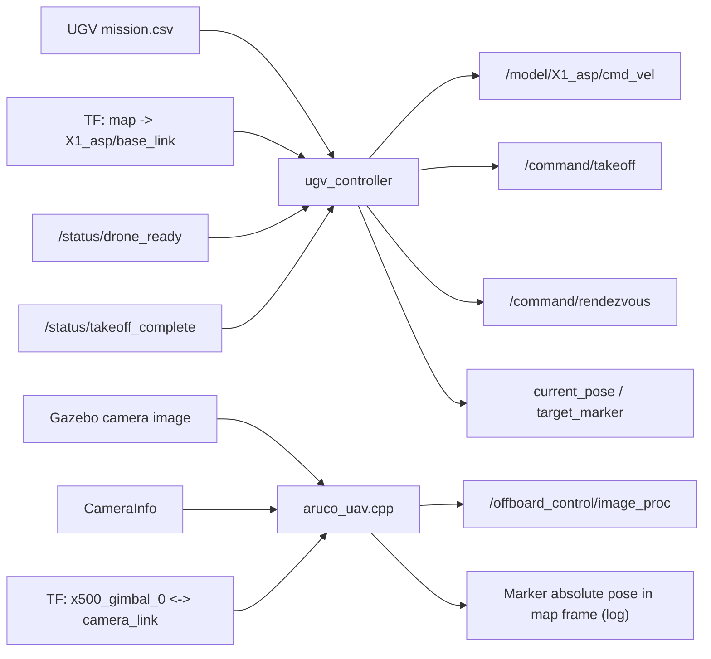

# UAV-UGV Cooperation-Based Autonomous System Platform

## 개요


담당: UGV 경로 추종 및 미션 구간 제어 + UAV에서의 ArUco 마커 인지 모듈 구현

이 README는 직접 구현한 ugv_controller 패키지 전체와 uav_controller/src/aruco_uav.cpp를 설명하기 위한 문서입니다. UAV 전체 미션 상태기계, PX4 오프보드 비행 제어, Gazebo 환경 구성, TF 브리지 구성은 프로젝트 전체에는 포함되지만 제 담당 범위는 아니므로 여기서는 설명하지 않습니다.

## 담당 범위

| 영역 | 패키지/모듈 | 구현한 내용 |
|---|---|---|
| Ground Control | [`ugv_controller`](./ugv_controller) | `mission.csv` 기반 경로 추종, TF 기반 UGV pose 추정, PID 속도/조향 제어, 곡률 기반 속도 조절, 이륙 지점 정차 로직, UAV 이륙/랑데부 신호 송수신 |
| UAV Vision | [`uav_controller/src/aruco_uav.cpp`](./uav_controller/src/aruco_uav.cpp) | 카메라 영상 기반 ArUco 검출, `CameraInfo` 보정값 반영, OpenCV pose 추정, 카메라-기체 오프셋 보정, TF 기반 `map` 좌표 변환, 디버그 이미지 발행 |


## 시스템 목표

제가 맡은 모듈 기준으로 이 시스템은 다음 흐름을 수행하도록 설계되었습니다.

UGV
- UGV가 미리 정의된 지상 경로를 따라 UAV 탑재 상태로 이동
- 지정된 waypoint에서 감속 및 정차 후 UAV 이륙 신호 전송
- UAV 이륙 완료 신호를 수신하면 UGV가 다음 경로를 계속 주행
- 전체 지상 미션 종료 후 UGV가 UAV에 rendezvous 시작 신호 전송

UAV
- UAV 카메라에서 ArUco 마커를 검출하고 map 기준 위치를 추정하여 좌표 추출
  

## End-To-End 파이프라인



## 주요 기능

### 1. UGV 경로 추종 및 미션 제어

- `mission.csv` 기반 waypoint 로딩
- TF에서 `map -> X1_asp/base_link`를 조회해 현재 위치와 yaw 추정
- PID 기반 속도 및 조향 제어
- waypoint 곡률 기반 속도 조절
- waypoint index 구간별 속도 프로파일 적용
- UAV 이륙 지점에서 감속, 정차, 이륙 신호 송신
- UAV 이륙 완료 후 다음 waypoint로 재출발
- 전체 지상 미션 종료 후 rendezvous 신호 발행

### 2. UAV 착륙용 ArUco 인지

- Gazebo 카메라 이미지와 `CameraInfo` 구독
- OpenCV ArUco 검출 및 `estimatePoseSingleMarkers` 기반 자세 추정
- OpenCV 좌표계 결과를 ROS/TF 좌표계로 변환
- 카메라와 기체 기준점 사이 오프셋을 반영한 상대 위치 보정
- TF를 사용해 마커 pose를 `map` 기준 절대 좌표로 변환
- 디버그용 processed image 발행

## 패키지별 요약

### `ugv_controller`

이 패키지는 지상 이동 제어를 맡습니다. UGV의 현재 pose를 TF에서 읽고, 미리 정의된 waypoint를 추종합니다.

- 주요 파일:
  - `ugv_controller/src/path_follower_node.cpp`
  - `ugv_controller/config/path_follower_params.yaml`
  - `ugv_controller/launch/path_follower.launch.py`
  - `ugv_controller/path/mission.csv`
- 입력:
  - `mission.csv`
  - TF `map -> X1_asp/base_link`
  - `/status/drone_ready`
  - `/status/takeoff_complete`
- 주요 출력:
  - `/model/X1_asp/cmd_vel`
  - `/command/takeoff`
  - `/command/rendezvous`
  - `current_pose`
  - `target_marker`

### `uav_controller/src/aruco_uav.cpp`

이 모듈은 UAV 착륙 단계에서 사용할 ArUco 기반 시각 인지 모듈입니다. 카메라 영상에서 마커를 검출하고, 마커 위치를 map 좌표계로 변환합니다.

- 주요 파일:
  - `uav_controller/src/aruco_uav.cpp`
- 입력:
  - `/world/default/model/x500_gimbal_0/link/camera_link/sensor/camera/image`
  - `/world/default/model/x500_gimbal_0/link/camera_link/sensor/camera/camera_info`
  - TF `x500_gimbal_0 <-> x500_gimbal_0/camera_link`
- 주요 출력:
  - `/offboard_control/image_proc`
  - `map` 기준 마커 절대 위치 로그

## 저장소 구조

```text
.
├── ugv_controller
│   ├── config
│   ├── launch
│   ├── path
│   └── src
│       └── path_follower_node.cpp
└── uav_controller
    └── src
        ├── aruco_uav.cpp
        └── uav_controller.cpp
```

## 기술 스택

- ROS 2 Humble
- Gazebo Classic
- PX4 message interface
- C++
- TF2
- OpenCV ArUco

## 요약

- UGV waypoint 추종 및 속도 제어
- UAV 이륙 지점 정차 및 신호 연동
- rendezvous 시작 신호 처리
- UAV 카메라 기반 ArUco 마커 검출
- TF 기반 마커 절대 위치 추정


## 결과 시각화

https://github.com/user-attachments/assets/e3c88933-8b82-478f-a515-dd36abcf625f


https://github.com/user-attachments/assets/61199571-f7c7-41ee-9fd4-60a1711cf595

https://github.com/user-attachments/assets/710f2c2f-74f4-4946-86f6-12cccbf7fc6c
